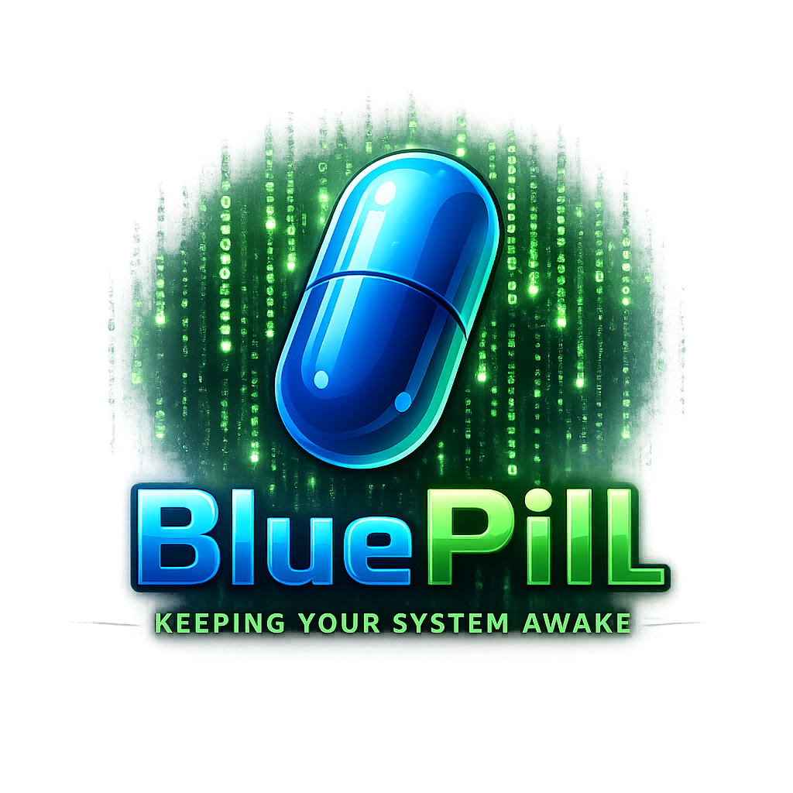

<p align="center">
  
</p>

# BluePill

**BluePill** es una pequeña utilidad multiplataforma escrita en Python e inspirada en *The Matrix*.

Su propósito es mantener el sistema despierto simulando una cantidad mínima de actividad, sin servicios, procesos persistentes ni modificaciones al sistema.

> **“You take the blue pill — the story ends.”**

---

## 🧠 ¿Qué hace?

- Simula actividad mínima mediante movimientos del cursor y pulsaciones de **SHIFT**
- Permite configurar el intervalo entre movimientos
- Detecta actividad real del usuario
- Pausa automáticamente el movimiento al detectar actividad humana
- Permite detener BluePill globalmente mediante **Esc + E**
- Confirma visualmente el cierre moviendo el cursor al centro de la pantalla
- Permite seleccionar el idioma de los mensajes mediante `config.json`
- Evita que el sistema entre en reposo o bloquee la sesión

Cuando BluePill detecta que el usuario vuelve a utilizar el computador, suspende temporalmente su actividad automática durante **10 segundos**, permitiendo utilizar normalmente mouse y teclado.

Durante ese periodo —o en cualquier momento mientras BluePill está ejecutándose— puedes presionar:

```text
Esc + E
```

BluePill moverá el cursor al centro de la pantalla como confirmación visual y finalizará el proceso.

No instala servicios, no modifica el sistema y no deja configuración persistente fuera de su propio directorio.

---

## ⚙️ Requisitos

- Python 3.x
- `pyautogui`
- `pynput`

Instala las dependencias desde la raíz del proyecto:

```bash
pip install -r requirements.txt
```

También puedes instalarlas manualmente:

```bash
pip install pyautogui pynput
```

---

## 🔧 Configuración

BluePill utiliza un pequeño archivo `config.json`:

```json
{
  "language": "es",
  "movement_interval": 20
}
```

### Idioma

Actualmente están disponibles:

```text
es    Español
en    English
```

Los mensajes:

> You take the blue pill — the story ends...

y

> You close your eyes… the Matrix fades away.

forman parte de la identidad de BluePill y siempre se muestran en inglés.

### Intervalo de movimiento

`movement_interval` define el tiempo, en segundos, entre ciclos automáticos.

Valores recomendados:

| Valor | Intervalo |
|------:|-----------|
| 20 | 20 segundos |
| 30 | 30 segundos |
| 60 | 1 minuto |
| 120 | 2 minutos |
| 180 | 3 minutos |
| 300 | 5 minutos |

---

## ▶️ Uso

Ejecuta BluePill desde la raíz del proyecto:

```bash
python src/main.py
```

Puedes minimizar la terminal después de iniciarlo.

Si necesitas utilizar el computador, simplemente hazlo. BluePill detectará la actividad humana y suspenderá temporalmente sus movimientos automáticos.

Para finalizar BluePill desde cualquier lugar:

```text
Esc + E
```

El cursor se moverá al centro de la pantalla confirmando visualmente que BluePill se ha detenido.

También puedes finalizarlo desde la terminal mediante:

```text
Ctrl + C
```

La salida está manejada para cerrarse limpiamente.

---

## 📁 Estructura del proyecto

```text
bluepill/
├── img/
│   └── logo.png
├── src/
│   ├── banner.py      # ASCII banner
│   ├── bluepill.py    # Lógica principal
│   └── main.py        # Punto de entrada
├── config.json        # Configuración
├── requirements.txt   # Dependencias
└── README.md
```

---

## 🟦 Filosofía

BluePill pretende seguir siendo deliberadamente pequeño:

- Pequeño
- Simple
- Multiplataforma
- Sin instalación
- Sin servicios
- Sin persistencia
- Sin fricción

No intenta administrar el sistema ni convertirse en una aplicación residente.

Si tienes Python, puedes ejecutar BluePill.

Cuando el proceso termina, BluePill termina con él.

---

## 👨‍💻 Autor

Desarrollado por **Corvin Develop**.

---

<p align="center">
  <strong>Corvin Develop</strong>
</p>